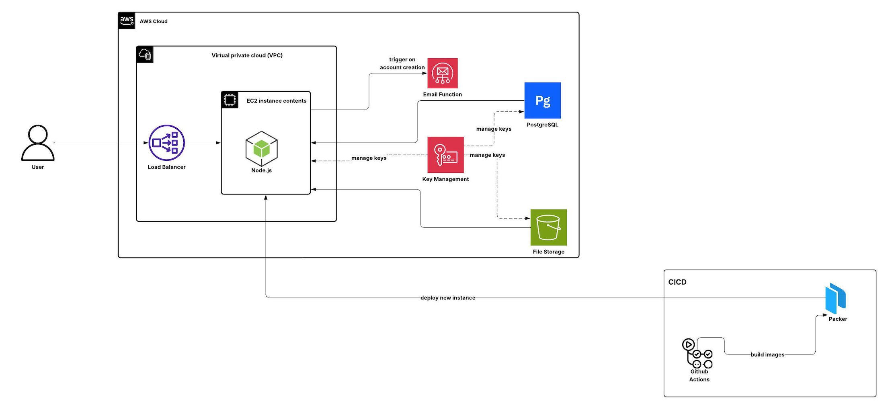

# HealthWeb

## Introduction

**HealthWeb** is a cloud-based web application deployed on AWS, using Terraform to manage the infrastructure as code.

## Key Features

- **Deployed on EC2**  
  The application is hosted on an Amazon EC2 instance, serving as the main compute environment.

- **RDS Integration**  
  A PostgreSQL database is hosted on Amazon RDS and connected to the EC2 instance for persistent storage.

- **S3 for User Profile Images**  
  User profile images are stored securely in an Amazon S3 bucket.

- **Auto Scaling**  
  EC2 instances are managed by an Auto Scaling Group that automatically scales up or down based on load.

- **CloudWatch Logging & Alarms**  
  All API calls are logged to Amazon CloudWatch, with alarms configured to trigger scaling events based on traffic metrics.

- **Email Verification via Lambda**  
  On account creation, an email verification is sent through a publish/subscribe model, triggering an AWS Lambda function.

- **Security & Encryption**  
  SSL certificates are issued to secure the web URL, and all data is encrypted using AWS KMS-managed encryption keys.

## Tech Stack

- Node.js
- PostgreSQL (Amazon RDS)
- AWS EC2, S3, RDS, CloudWatch, Lambda, KMS
- Terraform (for infrastructure provisioning)

## Cloud Architecture

